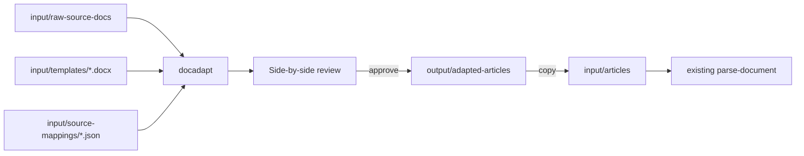

# Plan: Client doc → target template (isolated flow)

> **Status:** Implemented.  
> Isolated from Phase 1 / Phase 2. Existing generate/parse/package (CLI + Studio) remain usable without this flow.

## Overview

Map messy client DOCX files onto a Phase-1 target template DOCX via per-source-family mapping config and pluggable strategies. Optional Studio UI with side-by-side review. Core Phase 1/2 code stays unchanged.

## Isolation

| Keep existing | New (isolated) |
|---------------|----------------|
| `Main.java` generate/parse | `DocAdaptMain` — do **not** add modes to `Main` |
| analyzer, generator, parser, updater, packagebuilder, profiles | Package `com.aem.bulkauthoring.docadapt.*` only |
| Studio generate / upload articles / build | Optional `/api/adapt/*` + Adapt panel; Phase 1/2 paths do not call adapt |
| `input/articles/`, `input/templates/` | `input/raw-source-docs/`, `input/source-mappings/`, `output/adapted-articles/` |

**Coupling rule:** `docadapt` uses Apache POI + Jackson only. It must **not** import `BlueprintUpdater`, `PackageBuilder`, `DocumentParser`, or profile classes. Shared convention only: `[[…]]` markers.



## Design principles

- **Reusable engine + source-specific config:** USB Headline/H1/Body/Disclosure rules live in mapping JSON, not hardcoded Java.
- **New source type = new mapping JSON:** Point `targetTemplate`, write `slots[].extract` rules; same engine.
- **Low user load:** Ship ready USB → `normal-page` mapping; derive slots from template markers.
- **Strategies:** Mapping picks `strategy`; v1 = `rule-engine`.
- **Optional UI:** Adapt panel is non-blocking; existing Studio flows work with no mappings.

## Pipeline stages

1. Discover slots from target template `[[path]]` markers.
2. Normalize source DOCX → ordered blocks (paragraphs, headings, tables).
3. Apply mapping strategy → `Map<path, String>` (+ source excerpts for review).
4. Clone template; fill values under markers; clear unmapped slots.
5. Write `output/adapted-articles/<stem>.docx` + `<stem>.review.json`.

## Mapping language

Path: `input/source-mappings/<id>.json`

```json
{
  "id": "usb-content-hub-normal-page",
  "strategy": "rule-engine",
  "targetTemplate": "input/templates/normal-page.docx",
  "sourceDir": "input/raw-source-docs",
  "slots": [
    {
      "path": "/jcr:content/jcr:title",
      "extract": {
        "type": "tableRowValue",
        "sectionContains": "Headline",
        "labelContains": "*H1",
        "valueColumn": 1
      }
    },
    {
      "path": "/jcr:content/root/container/container/text/text",
      "extract": {
        "type": "elementSequenceHtml",
        "startAfterSectionContains": "*Body",
        "stopBeforeSectionContains": "Disclosure",
        "elementColumn": 0,
        "contentColumn": 1,
        "tagMap": {
          "p-text": "p",
          "H2": "h2",
          "Unordered list": "ul"
        }
      }
    }
  ]
}
```

### Extract `type` values (v1)

| `type` | Purpose |
|--------|---------|
| `tableRowValue` | Section → table row by label → cell value |
| `elementSequenceHtml` | Tables between start/stop; Element→HTML tags |
| `headingBody` | Text under a heading |
| `paragraphIndex` | Nth non-empty paragraph |
| `literal` | Fixed `value` |
| `documentTitle` | First substantial para / filename |

## Studio UI

- `GET /api/adapt/mappings`
- `POST /api/adapt/run` — mapping id + source files → job + review payloads
- `GET /api/adapt/review/{jobId}`
- `POST /api/adapt/send-to-articles` — copy approved adapted files
- `GET /api/adapt/download/{jobId}/{file}` — download adapted DOCX

**Review:** Left = source plain text; Right = mapped slots; below = path | sourceExcerpt | value. Approve before send-to-articles.

## Classes

```
com.aem.bulkauthoring.docadapt/
  DocAdaptMain.java
  DocAdaptService.java
  model/NormalizedDocument.java, DocBlock.java, TableBlock.java, ...
  extract/SourceDocumentNormalizer.java
  mapping/SourceMapping.java, SlotRule.java, ExtractRule.java
  strategy/AdaptStrategy.java, RuleEngineStrategy.java, ExtractedSlot.java
  fill/TemplateSlotFiller.java, TemplateSlotDiscovery.java
  review/AdaptReviewModel.java
```

## How to run

```bash
mvn -q compile exec:java -Dexec.mainClass="com.aem.bulkauthoring.docadapt.DocAdaptMain" \
  -Dexec.args="usb-content-hub-normal-page"
```

Then copy approved outputs to `input/articles/<profileId>/` and run existing Phase 2, or use Studio Adapt → review → Send to articles → Build package.

## Out of scope (v1)

- Making adapt required for readiness
- In-UI mapping rule editor
- LLM strategy / PDF inputs

## Related docs

- [Phase 1: Template generation](../phase-1-template-generation.md)
- [Phase 2: Package pipeline](../phase-2-package-pipeline.md)
- [Writing blueprint profiles](../writing-blueprint-profiles.md)
