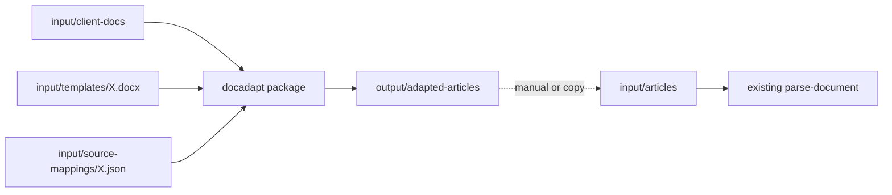

# Plan: Client doc → target template (isolated flow)

> **Status:** Planned — not implemented yet.  
> Use this document to instruct an AI (or developer) to implement the feature later.  
> Do **not** change existing Phase 1 / Phase 2 code while building this.

## Overview

Add an isolated workflow that maps messy client DOCX files onto a Phase-1 target template DOCX via per-blueprint mapping config, without changing existing generate/parse/package code.

## Isolation (how we keep it decoupled)

| Keep existing | New (isolated) |
|---------------|----------------|
| [`Main.java`](../../src/main/java/com/aem/bulkauthoring/Main.java) generate/parse | **New entry point** `DocAdaptMain.java` — do **not** add modes to `Main` |
| `analyzer`, `generator`, `parser`, `updater`, `packagebuilder`, `blueprint` profiles | **New package only:** `com.aem.bulkauthoring.docadapt.*` |
| `input/articles/`, `input/templates/` as used today | New dirs: `input/client-docs/`, `input/source-mappings/`, `output/adapted-articles/` |

**Coupling rule:** `docadapt` may use Apache POI + Jackson only. It must **not** import `BlueprintUpdater`, `PackageBuilder`, `DocumentParser`, or profile classes. It only needs:

- Path to a **target template DOCX** (already generated by Phase 1)
- A **mapping file** (written once per blueprint)
- Client DOCX files

After adapt, ops copy (or a one-line optional copy) into `input/articles/` and run existing Phase 2 unchanged.



## What the flow does

1. Load target template DOCX; discover slots = paragraphs matching `[[...]]` (same marker convention as today).
2. Extract structure from each client DOCX: title (first non-empty para or filename), heading sections (Word style Heading1/2 or ALL-CAPS lines), body paragraphs under each heading, document order index.
3. Apply mapping file: rules → slot path → text value.
4. Clone template; for each slot, replace the **value paragraph(s)** under the marker (leave marker lines untouched).
5. Write `output/adapted-articles/<client-filename>.docx`.

Unmapped slots: clear value to **empty** so missing client content is obvious (do not leave stale template seed).

## Mapping file (manual once per blueprint)

Path: `input/source-mappings/<name>.json` (example `normal-page.json`).

```json
{
  "targetTemplate": "input/templates/normal-page.docx",
  "slots": [
    { "path": "/jcr:content/jcr:title", "from": "documentTitle" },
    { "path": "/jcr:content/root/container/container/author/fname", "from": "headingBody", "heading": "Author First Name" },
    { "path": "/jcr:content/root/container/container/text/text", "from": "headingBody", "heading": "Body", "join": "paragraphs" },
    { "path": "/jcr:content/root/container/container/author/lname", "from": "paragraphIndex", "index": 2 }
  ]
}
```

Supported `from` types (v1, keep small):

- `documentTitle` — first substantial paragraph or filename stem
- `headingBody` — text under a heading matching `heading` (case-insensitive contains)
- `paragraphIndex` — Nth non-empty paragraph (0-based)
- `literal` — fixed `value` string

Generic code interprets these. Blueprint-specific work = editing this JSON only.

## New classes (all under `docadapt`)

| Class | Role |
|-------|------|
| `DocAdaptMain` | CLI constants: mapping file path, `input/client-docs`, output dir |
| `ClientDocumentExtractor` | POI: paragraphs + heading/style → simple model |
| `SourceMapping` + `SlotRule` | Jackson load of mapping JSON |
| `SlotMapper` | extractor output + rules → `Map<path, String>` |
| `TemplateSlotFiller` | clone template DOCX, fill values under `[[path]]` |

No shared module with core except the marker pattern string `[[` / `]]` (duplicate a private constant in `docadapt` to avoid coupling).

## Implementation checklist

1. Create package `com.aem.bulkauthoring.docadapt` with the classes above.
2. Add `input/source-mappings/normal-page.json` example and `input/client-docs/` (with a short README or `.gitkeep`).
3. Add a short user guide [`docs/phase-3-client-doc-adapt.md`](../phase-3-client-doc-adapt.md) (how to run + map) once implemented; link from docs index.
4. Verify:
   - Mapping for `normal-page` + 1–2 messy client DOCX under `input/client-docs/`
   - Output adapted DOCX still has same `[[...]]` markers; values filled from client
   - Existing `Main` generate/parse still works with **no** code changes to those classes
   - Adapted file runnable through existing Phase 2 after copy to `input/articles/`

## Out of scope (v1)

- LLM mapping
- PDF inputs
- Changing Phase 1/2 or profiles
- Auto-writing mapping from profile (manual JSON is fine)

## How to run (after implementation)

```bash
mvn -q compile exec:java -Dexec.mainClass="com.aem.bulkauthoring.docadapt.DocAdaptMain"
```

Then copy `output/adapted-articles/*.docx` → `input/articles/` and run existing `Main` with `MODE = parse-document`.

## Related docs

- [Phase 1: Template generation](../phase-1-template-generation.md)
- [Phase 2: Package pipeline](../phase-2-package-pipeline.md)
- [Writing blueprint profiles](../writing-blueprint-profiles.md)
- [Project README](../../README.md)
