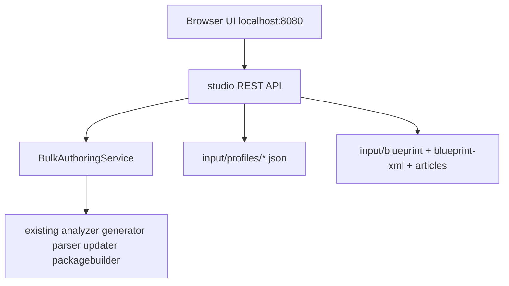

# Plan: UI layer + setup simplification (Blueprint Studio)

> **Status:** Implemented — see [phase-4-blueprint-studio.md](../phase-4-blueprint-studio.md).  
> This document remains the design reference. Do **not** break existing Phase 1 / Phase 2 CLI behavior while extending Studio.

## Overview

Add a local web UI (“Blueprint Studio”) so non-technical users can upload blueprint JSON/XML, auto-derive package config, visually select authorable components/fields, generate Word templates, and build content packages—without writing Java profiles, editing `Main`, or manually registering blueprints.

## Problem

Today, onboarding a blueprint means:

- Copying JSON into `input/blueprint/`
- Copying FileVault XML into `input/blueprint-xml/`
- Writing a Java profile (resource types, fields, `packageConfig()`)
- Registering in `BlueprintProfileRegistry`
- Pointing `BLUEPRINT_KEY` / `BLUEPRINT` / `MODE` in `Main`

That is easy for developers but hard to adopt in demos. Much of `packageConfig()` is already present in the XML package (sample page folder, parent path).

## Goals

- Non-tech friendly **local web UI** to manage blueprints and run Phase 1 / Phase 2
- **Auto-derive** `samplePageName`, `contentParentPath`, vault dir from XML; default `packageName`
- **Visual field picker** from analyzed JSON (components + properties)
- **No Java coding** for new blueprints (data-driven profiles)
- Keep existing CLI working (no break)


## Non-goals (v1)

- Cloud / multi-user auth
- Client-doc adapt (`docadapt`) integration — see [client-doc-to-template.md](client-doc-to-template.md)
- Live AEM HTTP authoring
- Generating Java `.java` profile source files

---


## Architecture decision (locked)


### 1. JSON-backed profiles (required for UI)

New blueprints are **data files**, not hand-written Java.

Example: `input/profiles/normal-page.json`

```json
{
  "id": "normal-page",
  "blueprintJson": "input/blueprint/page.json",
  "fields": [
    {
      "resourceType": "my-aem-site53/components/author",
      "property": "fname",
      "format": "PLAIN"
    },
    {
      "resourceType": "my-aem-site53/components/text",
      "property": "text",
      "format": "HTML"
    }
  ],
  "pageFields": [
    { "property": "/jcr:content/jcr:title", "format": "PLAIN" }
  ],
  "package": {
    "vaultPackageDir": "input/blueprint-xml/normal-page1",
    "contentParentPath": "/content/my-aem-site53/us/en/articles",
    "samplePageName": "normal-page1",
    "packageName": "bulk-content"
  }
}
```

**Implementation notes:**

- Add `JsonBlueprintProfile implements BlueprintTemplateProfile` that loads this file.
- Change `BlueprintProfileRegistry` to **scan** `input/profiles/*.json` (plus `reload()` after UI save).
- Migrate `NormalPageProfile` / `MeridianArticleProfile` to JSON equivalents so samples work through the same path.
- Avoid “UI writes `.java` + Maven compile” — that is fragile for non-tech users.


### 2. Local web app (isolated package)

New package: `com.aem.bulkauthoring.studio`


| Piece        | Choice                                                                         |
| ------------ | ------------------------------------------------------------------------------ |
| Server       | Lightweight embedded HTTP (e.g. **Javalin** or Spark Java) on `localhost:8000` |
| UI           | Simple HTML/CSS/JS wizard (or server-rendered pages) — keep dependency light   |
| Entry point  | `StudioMain` — do **not** overload existing `Main` modes                       |
| Shared logic | Extract `BulkAuthoringService` from `Main` for CLI + UI                        |





**Coupling rule:** Studio may call analyzer/generator/parser/updater/packagebuilder via the service layer. It must not force users to edit Java. Core marker/update/package behavior stays the same.

### 3. Auto-derive package config from XML

When the user uploads a FileVault package (zip):

1. Extract to `input/blueprint-xml/<id>/`
2. Detect sample page:
  - Prefer `META-INF/vault/filter.xml` root if single filter, **or**
  - Deepest `jcr_root/content/**/<page>/.content.xml` that is a full `cq:Page`
3. Derive:
  - `samplePageName` = last path segment (e.g. `normal-page1`)
  - `contentParentPath` = parent JCR path (e.g. `/content/my-aem-site53/us/en/articles`)
  - `vaultPackageDir` = extract folder
  - `packageName` = global default (e.g. `bulk-content`), editable once in UI settings
4. `id` = sanitized upload name / folder name (programmatic)

Example mapping from existing sample:

`.../articles/normal-page1` → sample `normal-page1`, parent `.../articles`

JSON upload → store as `input/blueprint/<id>.json`.

Optional **v2:** build JSON from `.content.xml` if user only has XML.

---


## UI flows (v1)

Phase 1 (**Generate template**) and Phase 2 (**Build package**) stay **two separate workflows** in the UI—same as CLI modes. Users switch via clear tabs / nav (e.g. “Generate template” | “Build package”), not one mixed screen that does both at once.

### Top-level navigation


| Tab / mode             | Purpose                                    | When enabled                                                                                                                             |
| ---------------------- | ------------------------------------------ | ---------------------------------------------------------------------------------------------------------------------------------------- |
| **Blueprints** (setup) | Upload JSON/XML, pick fields, save profile | Always                                                                                                                                   |
| **Generate template**  | Phase 1 only                               | When a blueprint is selected **and** ready for generate (see below)                                                                      |
| **Build package**      | Phase 2 only                               | When a blueprint is selected **and** ready for package (see below); otherwise tab/button **disabled** with a short “what’s missing” hint |


Do not auto-chain generate → package in one click in v1. User explicitly switches workflow when ready.

### A. Blueprints (setup library + wizard)

- List saved profiles from `input/profiles/`
- Create / edit / delete
- Wizard steps:
  1. **Upload** page JSON + FileVault zip
  2. Show **derived** package paths (read-only by default; advanced toggle to edit)
  3. **Component picker**: tree/cards from `BlueprintAnalyzer` — check fields; format PLAIN / HTML / LIST
  4. **Save** → write profile JSON + stored inputs; `registry.reload()`

Setup alone does not run generate or package.

### B. Workflow: Generate template (Phase 1 only)

**Enabled when all of:**

- Blueprint selected  
- Blueprint JSON file present on disk  
- Profile saved with at least one authorable field (or page field)  
- (XML package not required for generate, but if already uploaded it is fine)

**User actions:** open Generate tab → confirm blueprint → **Generate** → download / open `input/templates/<id>.docx`.

No article upload on this screen.

### C. Workflow: Build package (Phase 2 only)

**Tab / primary action enabled only when all of:**


| Prerequisite             | Meaning                                                                                                          |
| ------------------------ | ---------------------------------------------------------------------------------------------------------------- |
| Blueprint selected       | Profile JSON exists and is loaded                                                                                |
| Profile complete         | Fields chosen + package config present (`vaultPackageDir`, `contentParentPath`, `samplePageName`, `packageName`) |
| XML blueprint available  | FileVault folder/zip for that profile exists (scaffold for package)                                              |
| Blueprint JSON available | Same JSON used for updates                                                                                       |
| Articles available       | At least one `.docx` chosen/uploaded for this run (or present under the blueprint’s articles area)               |


If any check fails: **Build package** stays disabled; UI lists missing items (e.g. “Upload FileVault XML”, “Add at least one article DOCX”, “Save field selection”).

**User actions (when enabled):** select/upload articles → **Build package** → run Phase 2 only → download zip.

No template generation on this screen.

### Readiness API (for UI enable/disable)

Expose something like `GET /api/blueprints/{id}/readiness` returning:

```json
{
  "generateTemplate": { "ready": true, "missing": [] },
  "buildPackage": { "ready": false, "missing": ["vaultPackage", "articles"] }
}
```

UI binds tab enabled state to this (re-fetch after uploads/saves).

No `Main` mode switching for UI users. CLI `Main` remains for power users.

---


## Suggested API


| Method  | Path                                     | Purpose                                                    |
| ------- | ---------------------------------------- | ---------------------------------------------------------- |
| GET     | `/api/blueprints`                        | List profiles                                              |
| POST    | `/api/blueprints`                        | Create (multipart: json + zip + name)                      |
| GET     | `/api/blueprints/{id}/components`        | Analyzed tree for picker                                   |
| PUT     | `/api/blueprints/{id}/fields`            | Save selected fields                                       |
| GET     | `/api/blueprints/{id}/readiness`         | Which workflows are enabled + missing prereqs              |
| POST    | `/api/blueprints/{id}/generate-template` | Phase 1 only                                               |
| POST    | `/api/blueprints/{id}/build-package`     | Phase 2 only (multipart articles); reject 400 if not ready |
| GET/PUT | `/api/settings`                          | Default package name, etc.                                 |


Run:

```bash
mvn -q compile exec:java -Dexec.mainClass="com.aem.bulkauthoring.studio.StudioMain"
```

Open `http://localhost:8080`.

---


## Backend work (without breaking core)


| Change                                             | Purpose                              |
| -------------------------------------------------- | ------------------------------------ |
| `JsonBlueprintProfile` + registry scan/`reload()`  | Data-driven blueprints               |
| Migrate sample profiles to `input/profiles/*.json` | Prove path; CLI still works          |
| `BulkAuthoringService` extracted from `Main`       | Shared CLI + UI                      |
| `VaultPackageInspector`                            | Derive sample page + parent from XML |
| `studio` API + wizard UI                           | Non-tech surface                     |
| User guide after build                             | `docs/phase-4-blueprint-studio.md`   |


Do **not** change marker convention, path-based updater, or FileVault zip shape.

---


## Implementation phases

1. **Foundation** — JSON profile model + registry scan; migrate Normal/Meridian; CLI via JSON
2. **Derive + service** — `VaultPackageInspector` + `BulkAuthoringService`
3. **Studio API + minimal UI** — upload, picker, save, generate, package
4. **Polish** — clearer pictorial tree, downloads, validation messages, settings

---


## Risks / mitigations


| Risk                           | Mitigation                                                                    |
| ------------------------------ | ----------------------------------------------------------------------------- |
| XML has many page folders      | Prefer single `filter.xml` root; else largest full page `.content.xml`        |
| Users still need infinity.json | Wizard help text: append `.infinity.json` to page URL in AEM                  |
| Static registry                | Add `reload()` after every UI save                                            |
| Heavy frameworks               | Prefer Javalin + static HTML over full Spring Boot unless team prefers Spring |


---


## How this relates to other plans


| Plan                                               | Relation                                                         |
| -------------------------------------------------- | ---------------------------------------------------------------- |
| [Phase 1 / 2 docs](../README.md)                   | Studio wraps these; does not replace engines                     |
| [Client doc → template](client-doc-to-template.md) | Separate future flow; Studio can later add a button to run adapt |


---


## Implementation checklist (for AI / developer)

1. Introduce `input/profiles/` JSON schema + `JsonBlueprintProfile`.
2. Registry loads JSON profiles; migrate two samples; verify CLI Phase 1/2 still work.
3. Extract `BulkAuthoringService` from `Main`.
4. Implement `VaultPackageInspector` with unit-style checks on `normal-page1` / `poc-3`.
5. Add `studio` package: `StudioMain`, REST API, wizard UI with **separate** Generate vs Build tabs.
6. Wire upload → store files → derive config → field picker → save profile.
7. Implement readiness checks; disable Build package until XML + articles + profile are ready.
8. Wire Generate and Build as separate actions (no combined one-click).
9. Write `docs/phase-4-blueprint-studio.md` and link from docs index.


## Related docs

- [Phase 1: Template generation](../phase-1-template-generation.md)
- [Phase 2: Package pipeline](../phase-2-package-pipeline.md)
- [Writing blueprint profiles](../writing-blueprint-profiles.md) — current Java approach (Studio replaces this for non-tech users)
- [Plan: Client doc → template](client-doc-to-template.md)
- [Project README](../../README.md)

